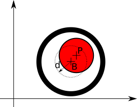

# La Buca

La buca si trova nella parte sinistra dello schermo e è un cerchio grande il doppio della palla. Ogni volta che facciamo
buca scompare e riappare in un altro punto questa volta preso a caso in tutto lo schermo.

## Il personaggio Buca

Come abbiamo fatto per la pallina prima la aggiungiamo al gioco dandogli coordinate del centro e dimensione. Quindi
in `hole.kv`, dentro a `<HoleGame>:` e prima di `Ball` mettimao:

```
    Hole:
        center: root.width/6, root.center_y
        size: 80, 80
```

Anche questa volta quando proviamo a eseguirlo ci dice che non conosce la `class <Hole>`. E come l'altra volta lo 
accontentiamo aggiungendo a `main.py`

```python
class Hole(Widget):
    pass
```

Ora non si arrabbia più, ma comunque non si vede niente, infatti non gli abbiamo detto come si deve disegnare una buca.
Rimediamo subito.

## Il disegno della Buca

Si tratta di una linea circolare di spessore 3. Quindi nel file `hole.kv` dobbiamo aggiungere prima di `<HoleGame>`

```
<Hole>:
    canvas:
        Line:
            width: 3
            circle: self.center_x, self.center_y, self.width/2
```

Rileggendo: dentro alla tela (`canvas`) abbiamo messo una linea (`Line`) spessa (`width`) 3 di tipo cerchio (`circle`).
Quando definiamo una linea di tipo cerchio bisogna dire dove è il centro e quanto è lungo il raggio,nel nostro caso
il centro lo abbiamo messo nel centro della *buca* e il raggio è metà della larghezza della buca.

Ora proviamo a far partire ... Come era successo per la palla non avviene nulla: infatti questo nuovo personaggio

## La Palla in Buca 

Per vedere se la pallina *finisce in buca* ci basta guardare se i centri di buca e pallina sono abbastanza *vicini*



Quindi se la disatnza del centro della pallina `P` dal centro della buca `B` è minore della distanza `d` allora la palla 
è in buca. La disatnza di `d` è uguale al raggio della buca meno il raggio della palla.

Quello che ci manca ora è da `HoleGame` sapere dove si trovano la palla e la buca. Per collegare gli attori *kivy* usa
le `ObjectProperty`. Nel file `main.py` in alto mettimao

```python
from kivy.properties import ObjectProperty
```

e nella classe `HoleGame` aggiungiamo i due oggetti:

```python
class HoleGame(Widget):
    ball = ObjectProperty(None)
    hole = ObjectProperty(None)
```

E modifichiamo `<HoleGame>` in `hole.kv` come segue:

```
<HoleGame>:
    hole: hole_id
    ball: ball_id

    Hole:
        id: hole_id
        center: root.width/6, root.center_y
        size: 80, 80

    Ball:
        id: ball_id
        center: root.center
        size: 40, 40
```

Ora se eseguiamo tutto è come prima, ma dentro a `HoleGame` possiamo sapere dove sono i centri di `ball` e `hole`. Per
verificarlo Invece di spostare la palla dentro a `Ball` la spostiamo da `HoleGame` e facciamo anche stampare le
coordinate dei centri.

Da `Ball` **togliamo** `on_touch_down()` e tutto il suo contenuto; dentro `class HoleGame` aggiungiamo

```python
    def on_touch_down(self, touch):
        self.ball.center = touch.pos
        print("ball = " + str(self.ball.center))
        print("hole = " + str(self.hole.center))
```

Provate e vedete cosa viene scritto.... `hole` e sempre fermo, ma `ball` si sposta.

Facciamo ora un altro piccolo passo: facciamo stamapare anche la distanza tra i due centri usando 

```python
distance = Vector(*self.hole.center).distance(self.ball.center)
print("distance = " + str(distance))
```

.... **dimenticavo** per usare `Vector` bisogna aggiungere in alto 
```python
from kivy.vector import Vector
```

Ora abbiamo tutto per scrivere una funzione in `HoleGame` che dice se la palla è in buca:

```python
    def ball_in_hole(self):
        distance = Vector(*self.hole.center).distance(self.ball.center)
        max_distance = ((self.hole.width - self.ball.width) / 2)
        return distance < max_distance
```

e cambiamo `on_touch_down()` per farci stampare questa verifica

```python
    def on_touch_down(self, touch):
        self.ball.center = touch.pos
        print("ball_in_hole = " + str(self.ball_in_hole()))
```

Ora potete verificare se la vostra palla entra in buca.

## Palla in Buca, la buca si sposta.

Ora vogliamo che tutte le volte che la palla è in buca la buca viene spostata. Vogliamo spostarla in un posto a caso
dello schermo di gioco. Per avere un numero a caso usiamo il solito `random.randint()` che prende il valore minimo
e il valore massimo. Se noi spostiamo `x` e `y` della buca dobbiamo fare in mdo che non siamo mai troppo grandi da far 
uscire la buca dal campo: Aggiungiamo quindi a `HoleGame` una funzione per piazzare la buca a caso

```python
    def random_hole(self):
        self.hole.x = random.randint(0, self.width - self.hole.width)
        self.hole.y = random.randint(0, self.height - self.hole.height)
```

Per usare `random` aggiungiamo in alto 

```python
import random
```

E `on_touch_down()` diventa

```python
   def on_touch_down(self, touch):
       self.ball.center = touch.pos
       if self.ball_in_hole():
           self.random_hole()
```
