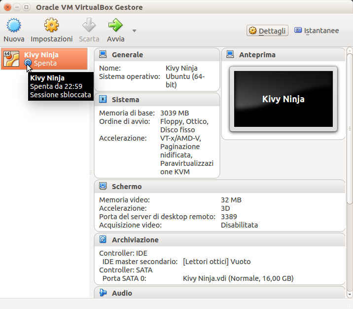
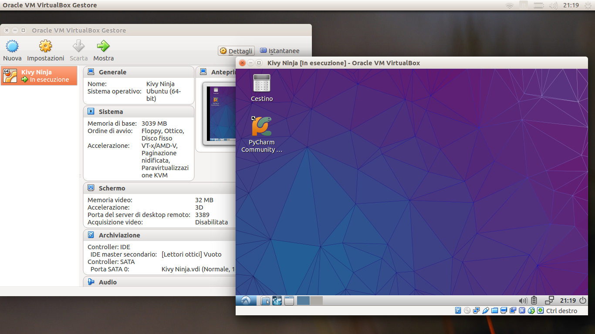
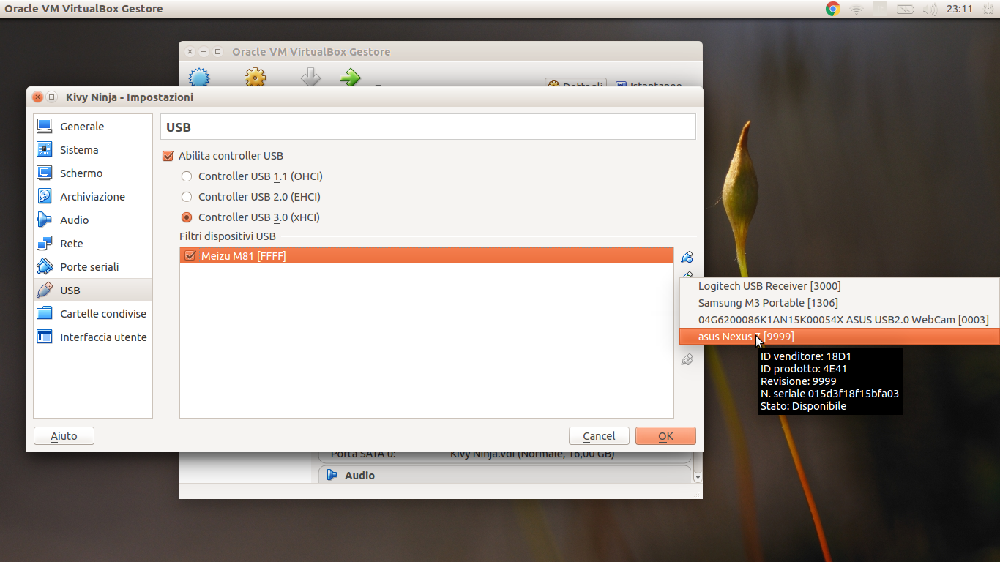

# Computer Nel Computer

Il computer è una scatola vuota con un programma che gira. Questo programma si chiama *Sistema Operativo*. Il 
*Sistema Operativo* sa come usare le periferiche (monitor, tastiera, mouse, dischi...) e come lanciare i programmi
che girano e usano il sistema operativo per accedere alle risorse del computer.

Ma allora se qualcuno scrive un programma che simula le risorse del computer e su questo programma *installiamo*
un altro *Sistema Operativo* potremo avere un **Computer nel Computer**.

## Perchè usare un Computer nel Computer

Molto spesso alcuni programmi per funzionare possono girare solo su determinati sistemi operativi e hanno bisogno di
diverse configurazioni. Ma queste configurazioni possono essere complicate o invasive, quindi se usiamo un computer 
nel computer riusciamo a usare quello di cui abbiamo bisogno senza troppi problemi.

Per questo dojo useremo **Kivy** e **buildozer**. **Kivy** è una *libreria* (o meglio un *framework*) Python per 
realizzare interfacce grafiche particolarmente orientato a apparecchi touch come smartphone e tabblet. **buildozer°°
serve per trasformare un programma python in un eseguibile android o ios.

Entrambi questi strumenti presentano dei problemi, in particolare buildozer funziona solo su Linux. Visto che non 
potevamo avere tutti Linux useremo un computer Linux nel vostro computer che potrà essere Windows, Mac o Linux.

## VirtualBox

Esistono tanti programmi che si possono usare per avere un Computer nel Computer. Noi useremo VirtualBox che forse non 
è il migliore, ma sicuramente è quello che rende la vita più semplice.

Ora facciamo un doppio click su **Kivy Ninja** e il nostro nuovo computer partirà... Sarà come veder partire un computer 
da zero; si tratta di un Sistema Operativo Linux Lubuntu (Linux parla tantissimi dialetti).

Dovrebbe partire senza chiedervi la password. Se mai dovesse chiedervi la password usate

* `ninja` (come l'utente)

Una volta partito dovreste vedere qualcosa tipo questo 

## Colleghiamo il telefono/tablet al Computer nel Computer

Collegate il vostro telefono con il cavo USB. Questo verrà catturato dal vostro sistema operativo e il computer dentro
virtualbox neanche se ne accorge. Bisogna dire a VirtualBox che vogliamo collegare questo dispositivo al computer che
sta facendo girare.

Prima spegnete il *Computer nel Computer* usando il simbolo di accessione in basso a destra. Poi sul pannello di 
controllo di VirtualBox cliccate sull'ingranaggio Impostazioni e selezionate USB.

Cliccate sull'icona dello spinotto USB e poi selezionate il vostro telefonino. Ora fate ripartire il coputer di 
virtualbox (i tecnici la chiamano *macchina virtuale*) e il vostro telefono dovrebbe aprirsi nel nuovo computer oltre
che in quello a cui è collegato fisicamente.

* [**NEXT** Progetto Vuoto](progetto_vuoto.md)
* [**PREV** Readme](Readme.md)
* [**INDEX** Readme](Readme.md)
