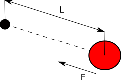

# La Molla Invisibile

Il nostro gioco è quasi completo... ma troppo semplice. Guidare la pallina usando il tocco sullo schermo come direzione
e velocità rende molto semplice guidare la pallina in buca. Vogliamo scrivere un *sistema di guida* più meno diretto.
 
L'idea è quella di usare una molla immaginaria: Ogni volta che appoggiamo il dito creiamo una molla che attrae la palla
verso il dito, quando rilasciamo la molla scompare.

Come funziona una molla:



Quando un oggetto è attaccato a una molla come ad esempio la nostra pallina rossa nel disegno, allora La pallina viene 
attratta dal punto in cui la molla è attacata con una forza **F** proporzionalle alla lunghezza **L** (la distanza tra
la palla e dove la molla è collegata). Per semplificare le cose abbiamo parlato di una molla *ideale* che ha come 
lunghezza minima 0, ma il concetto con le molle reali non cambia molto.

Quindi quello che faremo è:

1. Aggiungere a `HoleGame` un oggetto molla
2. In `update()` cambiare la velocità della palla usando la forza che la molla esercita sulla palla
3. In `on_touch_down()` aggiungere la molla e in `on_touch_up()` toglierla

## Aggiungiamo la molla

L'unica cosa che ci interessa della nostra molla sono le coordinate del suo centro. Ci basta quindi qualcosa del tipo
`(350, 200)` per rappresentare la molla con un centro in 350 x e 200 y.
 
In `main.py` nella classe `HoleGame` aggiungiamo:

```python
class HoleGame(Widget):
    spring = (350, 200)
```

Per ora non abbiamo ancora fatto niente se non dire che `HoleGame` contiene ina molla (`spring`). Ogni molla ha una 
forza caratteristica che descrive quanto è rigida una molla e quindi quanta *fatica* bisogna fare per allungarla e 
quanto forte attrae una volta che è allungata: questa caratteristica è il numero con il quale moltiplichiamo la 
lunghezza per avere l'intensità della forza: useremo 0,0005.

## Aggiorniamo la velocità della palla con la forza della molla

Scriviamo una funzione che torna la forza della molla che agisce sulla palla. In `HoleGame`
aggiungiamo 

```python
    def spring_strength(self):
        sx, sy = self.spring
        strength = Vector(sx, sy) - self.ball.center
        return strength * 0.0005
```

Per aggiornare la velocità della palla ci basta modificare `update()` aggiungendo in fondo:

```python
    def update(self, dt):
        ...
        strength = self.spring_strength()
        self.ball.velocity_x += strength.x
        self.ball.velocity_y += strength.y
```

## Mettiamo e togliamo la molla

Iniziamo senza molla: Dove avevamo messo la posizione `(350, 200)` mettiamo al suoposto `None` che in python vuol dire 
nulla.

```python
class HoleGame(Widget):
    spring = None
```

Se eseguiamo adesso abbiamo una brutta sorpresa

```
     sx, sy = self.spring
 TypeError: 'NoneType' object is not iterable
```

Effettivamente in `spring_strength()` stiamo provando a prendere delle coordinate x, y da `None` che non è sicuramente
una coppia di coordinate. Ma cosa dobbiamo fare quando la molla è `None`?

Quello che dovrebbe succedere che non esiste nessuna *forza*, anzi una forza nulla. Bene un `Vector` di coordinate
`(0, 0)` è quello che ci serve come forza nulla. Cambiamo `spring_strength()` per darci un valore coerente anche
quando non esiste la molla.

```python
    def spring_strength(self):
        if self.spring is None:
            return Vector(0, 0)
        sx, sy = self.spring
        strength = Vector(sx, sy) - self.ball.center
        return strength * 0.0005
```

Ora non esiste più l'errore, ma non esiste neanche più la molla.

Noi vogliamo che quando appoggiamo e spostiamo il dito la molla abbia le coordinate del tocco, quando smettiamo di
toccare la molla sparisce... Lo abbiamo già fatto un sacco di volte!!!

```python
class HoleGame(Widget):
    ...
    def on_touch_down(self, touch):
        self.spring = touch.pos

    def on_touch_move(self, touch):
        self.spring = touch.pos

    def on_touch_up(self, touch):
        self.spring = None
```

**Abbiamo FINITO!!!!!**

Per riassumere ecco che aspetto ha `main.py`

```python
import random
from kivy.app import App
from kivy.uix.widget import Widget
from kivy.vector import Vector
from kivy.properties import NumericProperty
from kivy.clock import Clock


class Hole(Widget):
    pass


class Ball(Widget):
    velocity_x = 0
    velocity_y = 0

    def move(self):
        self.pos = Vector(self.velocity_x, self.velocity_y) + self.pos

    def side_bounce(self):
        self.velocity_x = -self.velocity_x

    def vertical_bounce(self):
        self.velocity_y = -self.velocity_y


class HoleGame(Widget):
    spring = None
    score = NumericProperty(0)
    hole = None
    ball = None

    def update(self, dt):
        strength = self.spring_strength()
        self.ball.velocity_x += strength.x
        self.ball.velocity_y += strength.y
        self.ball.move()
        if self.ball_in_hole():
            self.random_hole()
            self.score += 1
        self.boundaries_bounce()

    def boundaries_bounce(self):
        if self.ball.x <= 0 or self.ball.right >= self.width:
            self.ball.side_bounce()
        if self.ball.y <= 0 or self.ball.top >= self.height:
            self.ball.vertical_bounce()

    def on_touch_down(self, touch):
        self.spring = touch.pos

    def on_touch_move(self, touch):
        self.spring = touch.pos

    def on_touch_up(self, touch):
        self.spring = None

    def random_hole(self):
        self.hole.x = random.randint(0, self.width - self.hole.width)
        self.hole.y = random.randint(0, self.height - self.hole.height)

    def ball_in_hole(self):
        distance = Vector(*self.hole.center).distance(self.ball.center)
        max_distance = ((self.hole.width - self.ball.width) / 2)
        return distance < max_distance

    def spring_strength(self):
        """
        :rtype: Vector
        """
        if self.spring is None:
            return Vector(0, 0)
        sx, sy = self.spring
        strength = Vector(sx, sy) - self.ball.center
        return strength * 0.0005


class HoleApp(App):
    def build(self):
        game = HoleGame()
        Clock.schedule_interval(game.update, 1.0/60.0)
        return game


if __name__ == '__main__':
    HoleApp().run()
```

Riportiamo anche `hole.kv` per completezza:

```
#:kivy 1.0.9

<Hole>:
    canvas:
        Line:
            width: 3
            circle: self.center_x, self.center_y, self.width/2

<Ball>:
    canvas:
        Ellipse:
            pos: self.pos
            size: self.size

<HoleGame>:
    hole: hole_id
    ball: ball_id

    Hole:
        id: hole_id
        center: root.width/6, root.center_y
        size: 80, 80

    Ball:
        id: ball_id
        center: root.center
        size: 40, 40

    Label:
        font_size: 70
        center_x: root.width / 4
        top: root.top - 50
        text: str(root.score)
```

Cos'altro possiamo fare? 

1. Potremmo gestire più molle (tocchi) contemporaneamente
2. Cambiare i colori
3. Inserire una durata a tempo
4. Cambiare la dimensione della buca col passare del tempo
5. ....

Ma per ora godiamoci questo.

* [**PREV** Punteggio](punteggio.md)
* [**INDEX** Readme](Readme.md)
