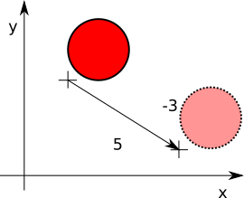

# Muovi la Palla

Muoviamo la palla per lo schermo facendola rimbalzare contro le pareti. Procediamo per passi:

1. Facciamo una funzione nella palla che quando viene chiamata si sposta. Usiamo il solito `on_touch_down()` per 
provarla.
2. Creiamo un orologio che chiama la funzione di movimento 60 volte al secondo.
3. Riconosciamo i bordi e invertiamo il verso.
4. Leghiamo la direzione/velocità della pallina a seconda di dove tocchiamo lo schermo.

## Una funzione per muovere

Muovere vuol dire cambiare la posizione. Quindi se nella pallina facciamo una funzione che cambia la sua posizione
in x aumentandola di 5 e quella in y diminuendola di 3 allora avremo uno spostamento.
 


Quindi in `main.py` nella clase `Ball` aggiungiamo:

```python
    def move(self):
        self.pos = Vector(5, -3) + self.pos

```

Mentre in `HoleGame` cambiamo `on_touch_down()` per provarla mettendola al posto del campio di posizione:

```python
    def on_touch_down(self, touch):
        self.ball.move()
        if self.ball_in_hole():
            self.random_hole()
```

Provate, e vedrete che la palla fa dei piccoli scattini, ma torna sempre al centro: provate a 
**togliere** `on_touch_up()` da `Ball` e vedrete che funziona. Tutte le volte che rilasciate avevate detto
 di tornare al centro....
 
## La palla si muove da sola

Oltre a muovere la pallina dovremo fare anche altre cose come controllare quando si toccano i bordi o quando la palla
è in buca. Facciamo quindi una funzione `update()` in `HoleGame` che si occuperà di fare tutte le cose che devono
essere fatte per far *muovere correttamente il gioco*. Iniziamo con mettrci dentro solo `self.ball.move()`.

```python
    def update(self):
        self.ball.move()
```

Adesso, dove costruiamo il gioco aggiungiamo che ogni sessantesimo di secondo (`1.0/60.0`) bisogna chiamare `update()`
di `HoleGame`. Prima aggiungiamo in testa a `main.py`

```python
from kivy.clock import Clock
```

E la funzione build di `HoleApp` diventa:

```python
    def build(self):
        game = HoleGame()
        Clock.schedule_interval(game.update, 1.0/60.0)
        return game
```

Ora si muove da sola....ma provate a fare buca!!! Non ci riuscite perchè chi si occupava di controllare se la palla
era in buca e spostarla è rimasta nella funzione `on_touch_down()`. Spostiamo quindi questo controllo in `update()`
e torniamo a usare `on_touch_down()` per spostare la palla.

```python
    def update(self, dt):
        self.ball.move()
        if self.ball_in_hole():
            self.random_hole()

    def on_touch_down(self, touch):
        self.ball.center = touch.pos
```

Provate, ora funziona tutto come previsto!

## La palla rimbalza quando tocca il bordo

Prima di far rimbalzare la pallina è meglio fare in maniera che si possa cambiare facimente la direzione: non possiamo
scrivere i numeri fissi, ma è meglio usare qualcosa che possiamo cambiare dal programma.

In `Ball` aggiungiamo

```python
    velocity_x = 5
    velocity_y = -3
```

E modifichiamo `move()` per usare `self.velocity_x` al posto di `5` e `self.velocity_y` al posto di `-3`. Gia che
ci siamo rimuoviamo `on_touch_move()` che non serve più. Rassumendo `Ball` diventa:

```python
class Ball(Widget):
    velocity_x = 5
    velocity_y = -3

    def move(self):
        self.pos = Vector(self.velocity_x, self.velocity_y) + self.pos
```

Adesso siamo in grado di scrivere una funzione nella palla che inverte la direzione laterale:

```python
    def side_bounce(self):
        self.velocity_x = -self.velocity_x
```

E chiamiamola nel solito `on_touch_down()` di `HoleGame`

```python
    def on_touch_down(self, touch):
        self.ball.center = touch.pos
        self.ball.side_bounce()
```

Bene, adesso non ci resta che verificare se la palla tocca i bordi e nel caso inverire la direzione. Dove lo facciamo?
.... ma in `update()` aggiungendo in fondo alla funzione

```python
    if self.ball.x <= 0 or self.ball.right >= self.width:
        self.ball.side_bounce()
```

Che ne dite di provare a fare da soli quello verticale? Giusto per fissare le idee:

1. la funzione di rimbalzo verticale si chiama `veritical_bounce()` e inverte `velocity_y`
2. Le coordinate verticali della palla da verificare `y` per la parte bassa e `top` per quella alta
3. L'altezza del gioco si chiama `height`
 
Comunque adesso riassumo quello che abbiamo aggiunto a `Ball` e tutta la funzione `update()`

```python
class Ball(Widget):
    ...
    def side_bounce(self):
        self.velocity_x = -self.velocity_x

    def vertical_bounce(self):
        self.velocity_y = -self.velocity_y

class HoleGame(Widget):
    ...
    def update(self, dt):
        self.ball.move()
        if self.ball_in_hole():
            self.random_hole()
        self.boundaries_bounce()
    
    def boundaries_bounce(self):
        if self.ball.x <= 0 or self.ball.right >= self.width:
            self.ball.side_bounce()
        if self.ball.y <= 0 or self.ball.top >= self.height:
            self.ball.vertical_bounce()
```

... Ho solo spostato i controilli e i rimbalzi in `boundaries_bounce()` perchè `update()` iniziava a diventare 
affollato.

## Lo schermo diventa un Joystick

Ora la direzione, quella che in ball abbiamo chiamato `velocity`, la cambiamo con i tocchi sullo schermo. Quindi 
prendiamo la posizione del tocco rispetto al centro dello schermo, siccome questo numero è troppo grande lo dividiamo
per la larghezza e lo moltiplichiamo per 10 (velocità massima). Credo che sia più facile scriverlo che spiegarlo:

```python
    def on_touch_down(self, touch):
        x, y = touch.pos
        direction = Vector(x, y) - self.center
        self.ball.velocity_x = direction.x / self.width * 10
        self.ball.velocity_y = direction.y / self.height * 10
```

Possiamo anche mettere la velocità iniziale a 0:

```python
class Ball(Widget):
    velocity_x = 0
    velocity_y = 0
```

Per riassumere il gioco ora dovrebbe essere circa così:

`main.py`
```python
import random
from kivy.app import App
from kivy.uix.widget import Widget
from kivy.vector import Vector
from kivy.properties import NumericProperty
from kivy.clock import Clock


class Hole(Widget):
    pass


class Ball(Widget):
    velocity_x = 0
    velocity_y = 0

    def move(self):
        self.pos = Vector(self.velocity_x, self.velocity_y) + self.pos

    def side_bounce(self):
        self.velocity_x = -self.velocity_x

    def vertical_bounce(self):
        self.velocity_y = -self.velocity_y


class HoleGame(Widget):
    hole = None
    ball = None

    def update(self, dt):
        self.ball.move()
        if self.ball_in_hole():
            self.random_hole()
        self.boundaries_bounce()

    def boundaries_bounce(self):
        if self.ball.x <= 0 or self.ball.right >= self.width:
            self.ball.side_bounce()
        if self.ball.y <= 0 or self.ball.top >= self.height:
            self.ball.vertical_bounce()

    def on_touch_down(self, touch):
        x, y = touch.pos
        direction = Vector(x, y) - self.center
        self.ball.velocity_x = direction.x / self.width * 10
        self.ball.velocity_y = direction.y / self.height * 10

    def random_hole(self):
        self.hole.x = random.randint(0, self.width - self.hole.width)
        self.hole.y = random.randint(0, self.height - self.hole.height)

    def ball_in_hole(self):
        distance = Vector(*self.hole.center).distance(self.ball.center)
        max_distance = ((self.hole.width - self.ball.width) / 2)
        return distance < max_distance


class HoleApp(App):
    def build(self):
        game = HoleGame()
        Clock.schedule_interval(game.update, 1.0/60.0)
        return game


if __name__ == '__main__':
    HoleApp().run()
```

Mentre `hole.kv` non è cambiato.


* [**NEXT** Punteggio](punteggio.md)
* [**PREV** Buca](buca.md)
* [**INDEX** Readme](Readme.md)
