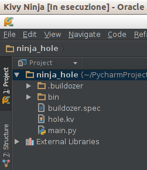
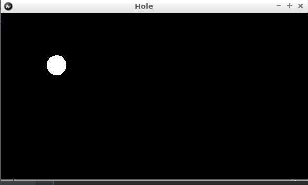

# Aggiungere la pallina e spostarla con il dito

Abbaimo provato la nostra app e per ora è solo uno schermo nero. Vogliamo aggiungere una pallina bianca allo schermo.

## Struttura

Guardiamo prima cosa abbiamo:



In ordine di importanza:

1. `main.py` Dove scriviamo la logica del programma
2. `hole.kv` Dove descriviamo la disposizione dei personaggi nella app
3. `buildozzer.spec` Dove diciamo come *impacchettare* la app per il telefonino
4. `bin` Dove viene messa la app pronta per essere caricata
5. `.buildozzer` Dove *dove viene fatto il lavoro sporco* per costruire la app

Per ora ci interessano solo i file `hole.kv` e `main.py`:

`main-py`
```python
from kivy.app import App
from kivy.uix.widget import Widget


class HoleGame(Widget):
    pass


class HoleApp(App):
    def build(self):
        game = HoleGame()
        return game


if __name__ == '__main__':
    HoleApp().run()
```

`hole.kv`
```
#:kivy 1.0.9

<HoleGame>:
```

Non perdiamo troopo tempo a cercare di capire cosa contiene, ma riassumiamolo come

1. `main.py` ci dice che il gioco è composto da un `HoleGame` 
2. `hole.kw` ci dice che `HoleGame` è vuoto (schermo nero)

Il nome `hole.kv` viene da `HoleApp` senza `App` tutto in minuscolo: quando viene costruita una `App` si toglie
dal nome il finale `App` si mette tutto minuscolo e si aggiunge `.kv`, questo file deve contenere la descrizzione.

## La Pallina

Per aggingere la pallina dobbiamo inserire nel file `hole.kv` un nuovo personaggio, la pallina, e dire in che possizione
mettrla nel gioco `HoleGame` e poi indicare come disegnarla

```
<HoleGame>:
    Ball:
        center: root.center
        size: 40, 40
```

Di questa pallina non abbiamo detto molto, solo di metterla in `HoleGame`, dove e la sua dimensione... ma a dire il vero
non abbiamo detto ninete di come disegnarla. Il computer è abbastanza inteligente da capirlo da solo? Basta il nome 
`Ball`?

Proviamo: ... ops

```
   File "/usr/lib/python2.7/dist-packages/kivy/factory.py", line 131, in __getattr__
     raise FactoryException('Unknown class <%s>' % name)
 kivy.factory.FactoryException: Unknown class <Ball>
```

Ci dice che non conosce la `calss <Ball>`. Bene caccontetiamolo, creaimo una `class Ball`, essendo qualcosa da mettere 
sullo schermo deve essere almeno un `Widget`... troppe parole: Aggiugiamo a `main.py`

```python
class Ball(Widget):
    pass
```

Nessun errore! ma della palla nemmeno l'ombra. E' il momemwnto di dirgli come è fatta una palla: in `hole.kv` 
aggiungiamo

```
<Ball>:
    canvas:
        Ellipse:
            pos: self.pos
            size: self.size
```

Come per magia ecco comparire la palla.

## Angolo noiso

Come mai è comparsa la pallina? Cosa abbiamo scritto per dirgli di disegnarla:

* `canvas` in inglese vuol dire tela, dove stiamo disegnando
 * `Ellipse` Una ellisse
  * `pos` dove mettere l'ellisse (angolo in alto a sinistra) dove si trova `self` (`Ball`)
  * `size` dimesioni, stesse di `self` (`Ball`) che abbiamo definito in `HoleGame`
  
Cosa sono `root`, `self` e `parent`:

1. `root` è il contenitore di tutto, nel nostro caso `HoleGame`
2. `self` è il componente che stiamo descrivendo
3. `parent` è il componente che contiene il componente

## Spostare la pallina

Basta dire alla `Ball` che quando si tocca lo schermo (`on_touch_down`) di spostare il centro dove abbaimo toccato:

`main.py`

```python
class Ball(Widget):
    def on_touch_down(self, touch):
        self.center = touch.pos
```

Proviamolo: quando clicchiamo la pallina si sposta.



Ora vogliamo:

1. Quando trasciniamo il dito seguire la pallina (`on_touch_move()`)
2. Quando alziamo il dito la pallina torna al centro (`on_touch_move()`)

```python
class Ball(Widget):
    def on_touch_down(self, touch):
        self.center = touch.pos

    def on_touch_move(self, touch):
        self.center = touch.pos

    def on_touch_up(self, touch):
        self.center = self.parent.center
```
