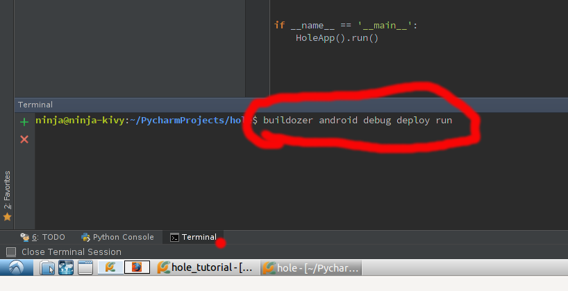

# Tabula Rasa

Siamo con il nostro *Computer Nel Computer* e vogliamo aprire il nostro primo programma vuoto da eseguire sul nostro
smartphone android.

Fare un progetto kivy da zero necessita di un po di tempo e una buona connessione a internet: due cose di cui 
scarseggiamo un po' nei nostri dojo. Usiamo quindi una piccola scorciatoia, nel computer che state usando avete un
progetto vuoto con il minimo indispensabile per partire.

Cliccate sull' icona di Pycharm e aprite il progetto **hole** (se non si apre da solo).

Per ora non ci interessa cosa contiene il progetto, ma solo farlo partire prima sul computer dove sviluppiamo e
poi sullo smartphone.

## Esecuzione sul computer

Usando la freccia verde in alto a destra (o in basso nella finestra run) o la combinazione di tasti *Alt-Maiusc-X* 
facciamo partire la finestra vuota che chiudiamo con la X.

## Esecuzione sul Tablet/Smartphone

Attivare il debug USB sul smartphone/tablet.

1. Impostazioni
2. Informazioni Sul Tablet
3. Tappate 7 volte su **Numero build**
4. Indietro Opzioni Sviluppatore
5. Attivate Debug USB
6. Scollegate e ricollegate lo smartphone


Tornate su PyCharm, in basso aprite il terminale **Terminal** e scrivete

```
buildozer android debug deploy run
```



Dovrebbe chiedrvi l'autorizzazione e poi installare l'APP. *Se vi chiede l'autorizzazione, ma poi falisce, riprovateci
che dovrebbe funzionare*. Alternativamente potete usare *Tools* -> *External Tools* -> *Buildozer Debug*.

## Se `buildozer` non funziona

La strada più semplice in questo caso è disattivare il debug USB e aprire la cartella nel gestore file. Fare
tasto destro su **ninja** e selezionare *apri in una nuova scheda*. Ora

* PyCharmProjects
* hole
* bin

Se avete perso la scheda con il telefono

* (Albero delle Directory)/Risorse
* Selezionate il telefono
* Memoria interna

Ora copiate `Hole-1.0-debug.apk` da `bin` a *Memoria Interna*.

Aprite il gestore file del telefono e installate la app con un tap su `Hole-1.0-debug.apk`. Vi chiederà se volete 
installare questa cattiva applicazione di origine sconosciuta: accettate e andate avanti.

**ATTENZIONE**: Potrebbe non volerlo fare. Sullo smartphone andate in :

* Impostazioni
* Sicurezza
* Origini Sconosciute

Ora possiamo passare a costruire [Hole](pallina.md).

## Coming Soon

Appena ho tempo scrivo come partire da zero per fare il progetto. [Progetto da zero](from_scratch.md)

* [**NEXT** Pallina](pallina.md)
* [**PREV** Computer Nel Computer](computer_nel_computer.md)
* [**INDEX** Readme](Readme.md)
