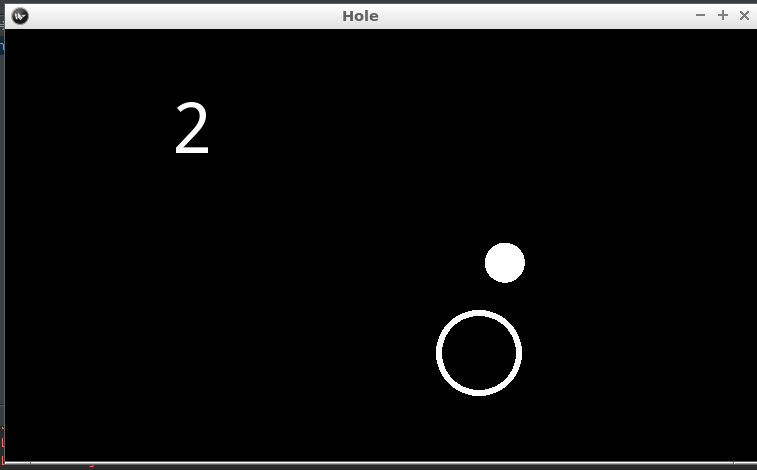

# Punteggio

Ogni volta che facciamo buca vogliamo aumentare il punteggio di un punto.

1. Aggiungiamo una scritta in alto a snistra.
2. Creiamo un punteggio in `HoleGame` e facciamo visualizzare nella scritta.
3. A ogni buca aumentiamo il punteggio.


## Mettiamo una scritta

Aggiungiamo una scritta in alto con scritto `"pippo"`. Ci basta modificare solo il file `hole.kv` aggingendo a 
`<HoleGame>` una `Label`

```
<HoleGame>:
    Label:
        font_size: 70
        center_x: root.width / 4
        top: root.top - 50
        text: "pippo"
```

* Dimensione del carattere `font_size` 70
* Coordinata x del centro a un quarto della larghezza
* 50 punti dal bordo sopra
* il testo `"pippo"`

## Creiamo il punteggio

Per poter gestire automaticamente il collegamento tra il cambio di un valore e il suo effetto kivy fornisce le  
`Property`, in particolare per i numeri le `NumericProperty`. Queste proprietà possono essere usate nei personaggi
per mantenere un valore e nei file `.kv` per usarlo con un effetto di aggiornamento automatico.

Una prova pratica è meglio di mille parole:

Prima di tutto dobbiamo dire nel programma che vogliamo usarle aggiungendo in alto

```python
from kivy.properties import NumericProperty
```

Nella classe `HoleGame` aggiungiamo una `NumericProperty` chiamata `score` (punteggio)

```python
class HoleGame(Widget):
    score = NumericProperty(0)
```

Nel file `hole.kv` al posto di `text: "pippo"` mettiamo

```
        text: str(root.score)
```

Se eseguiamo dovrebbe comparire `0` al posto di `pippo`. Quello che abbiamo fatto è stato collegare la stritta
alla proprietrà `score` del nostro gioco, infatti `root` ci permette di identificare la *radice* del nostro gioco
(`HoleGame`) dove abbiamo attacato `score`.

## Aumentiamo il punteggio

Ogni volta che la palla è in buca `score` aumenta di 1. In `update()` abbiamo già questa verifica, ci basta aggiungere 
sotto a `self.random_hole()` una riga con `self.score += 1`. Riscriviamo `update()`:

```python
    def update(self, dt):
        self.ball.move()
        if self.ball_in_hole():
            self.random_hole()
            self.score += 1
        self.boundaries_bounce()
```



Quindi la classe `HoleGame` la abbiamo modificata aggiungendo solo

```python
class HoleGame(Widget):
    score = NumericProperty(0)
    ...
    def update(self, dt):
        self.ball.move()
        if self.ball_in_hole():
            self.random_hole()
            self.score += 1
        self.boundaries_bounce()
```

e nel file `kivi.kv` nella descrizione di `<HoleGame>` abbiamo aggiunto

```
<HoleGame>:
    ...
    Label:
        font_size: 70
        center_x: root.width / 4
        top: root.top - 50
        text: str(root.score)
```